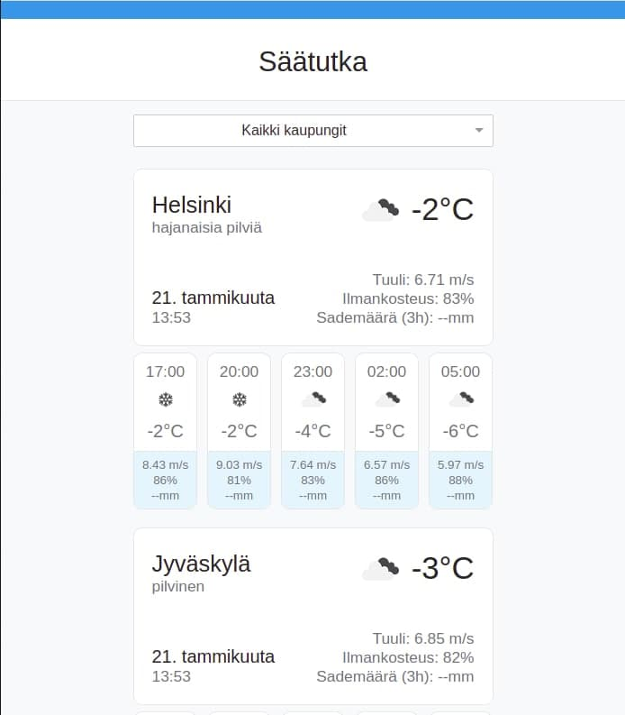
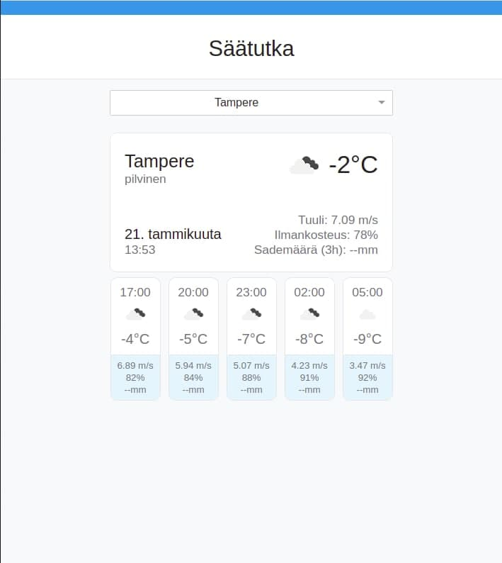
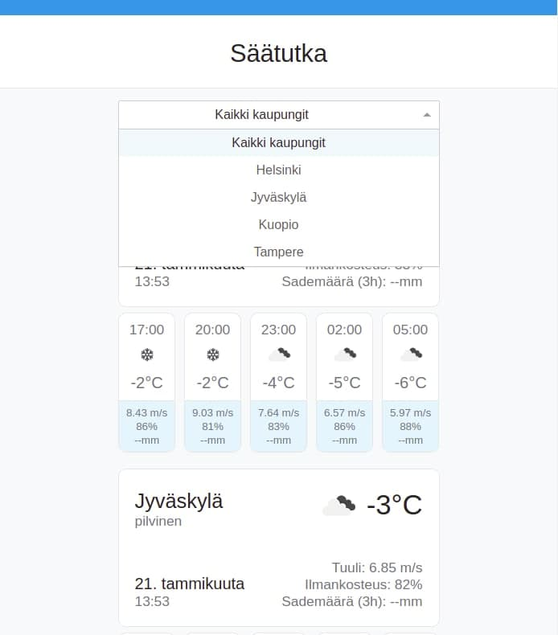

# Säätutka-harjoitus, web

Part of a recruitment process. A React app that uses OpenWeather's
Weather API to show weather information for select locations in Finland.

## How to run

Run `REACT_APP_MOCK_API=0 npm start` and navigate to [http://localhost:3000](http://localhost:3000) to view the project in your browser.

API configuration is done by copying `src/api-config.json.template` to `src/api-config.json` and inserting your personal API key.

To run app with mock values (which don't call the Weather API), run `REACT_APP_MOCK_API=1 npm start`. This is used for testing styling with nonsense data being displayed.

## Notes
* Created with create-react-app.
* OWM api will block you for some amount of time if you run too many requests
too fast so be mindful of this. Requests are only generated when you change your
selection in the dropdown.

## Screenshots

